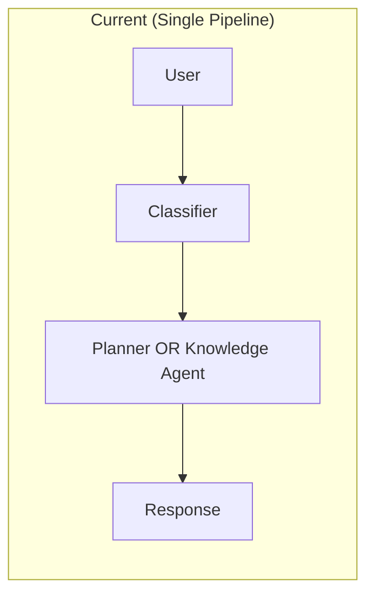
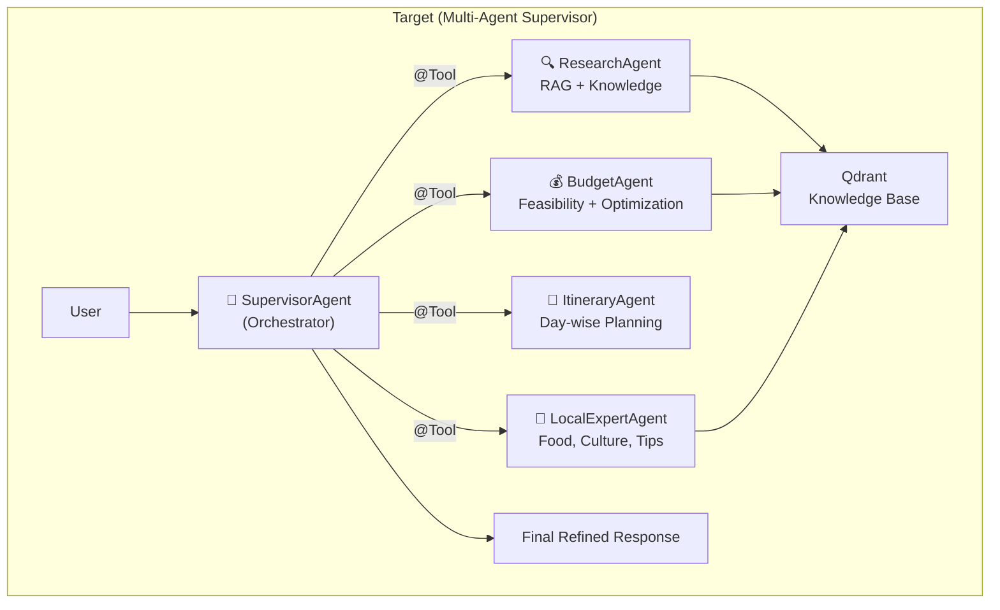

# 🤖 Agentic AI Multi-Agent Architecture — Implementation Plan

## Goal

Transform the Travel AI Assistant from a single-pipeline system into an **industry-grade multi-agent system** where specialized agents collaborate (discuss, debate, refine) to produce the best travel plan. This is **Phase 1** of a larger vision that includes hotel booking and ticket booking agents in the future.

---

## Current State vs Target State





---

## Phased Roadmap

> [!IMPORTANT]
> We'll implement in **3 phases**. Phase 1 (Agentic AI) is the current scope. Phases 2-3 are future.

| Phase | Scope | Status |
|---|---|---|
| **Phase 1** | Multi-Agent Supervisor System | 🎯 Current |
| **Phase 2** | Hotel & Ticket Booking Tools (APIs) | 🔮 Future |
| **Phase 3** | Full Automation (User Preferences → End-to-End Booking) | 🔮 Future |

---

## Phase 1: Proposed Changes

### Component 1 — Code Cleanup (Pre-requisite)

Before building the multi-agent system, clean up the existing code for a solid foundation.

#### [MODIFY] [DefaultItineraryPlanner.java](file:///c:/Users/Nisarg/OneDrive/Desktop/java/Langchain4j/Projects/Travel%20Assistant/src/main/java/com/n23/foa/travelassistant/service/DefaultItineraryPlanner.java)
- Remove ~180 lines of commented-out dead code (lines 162-342)
- Replace all `System.out.println` with SLF4J logging (`@Slf4j`)

#### [MODIFY] [EmbeddingConfig.java](file:///c:/Users/Nisarg/OneDrive/Desktop/java/Langchain4j/Projects/Travel%20Assistant/src/main/java/com/n23/foa/travelassistant/config/EmbeddingConfig.java)
- Fix hardcoded collection name `"travel-docs-ingestor"` → use `${qdrant.collection-name}`

#### [MODIFY] Multiple files
- Replace all `System.out.println` with `@Slf4j` across: [DefaultTravelAssistant](file:///c:/Users/Nisarg/OneDrive/Desktop/java/Langchain4j/Projects/Travel%20Assistant/src/main/java/com/n23/foa/travelassistant/service/DefaultTravelAssistant.java#11-44), [DefaultTravelPlanner](file:///c:/Users/Nisarg/OneDrive/Desktop/java/Langchain4j/Projects/Travel%20Assistant/src/main/java/com/n23/foa/travelassistant/service/DefaultTravelPlanner.java#16-130), [TravelContentRetriever](file:///c:/Users/Nisarg/OneDrive/Desktop/java/Langchain4j/Projects/Travel%20Assistant/src/main/java/com/n23/foa/travelassistant/retrievalAugmentor/TravelContentRetriever.java#23-90), [TravelContentInjector](file:///c:/Users/Nisarg/OneDrive/Desktop/java/Langchain4j/Projects/Travel%20Assistant/src/main/java/com/n23/foa/travelassistant/retrievalAugmentor/TravelContentInjector.java#12-88), [DefaultMultisectionRetriever](file:///c:/Users/Nisarg/OneDrive/Desktop/java/Langchain4j/Projects/Travel%20Assistant/src/main/java/com/n23/foa/travelassistant/retriever/meltisection_retriever/imple/DefaultMultisectionRetriever.java#21-148)

---

### Component 2 — New DTOs & Enums

#### [MODIFY] [TripConstraints.java](file:///c:/Users/Nisarg/OneDrive/Desktop/java/Langchain4j/Projects/Travel%20Assistant/src/main/java/com/n23/foa/travelassistant/dto/TripConstraints.java)
- Add `numberOfMembers` (Integer) field
- Add `travelStyle` (String — backpacker/comfort/luxury) field
- Add `interests` (List<String> — adventure, culture, nature, food, etc.) field

#### [NEW] AgentResponse.java
`src/main/java/com/n23/foa/travelassistant/dto/AgentResponse.java`
```java
public record AgentResponse(
    String agentName,
    String content,
    double confidenceScore
) {}
```

#### [NEW] TravelPlan.java
`src/main/java/com/n23/foa/travelassistant/dto/TravelPlan.java`
- Structured response DTO with: overview, budgetBreakdown, dayWiseItinerary, accommodationSuggestions, travelTips, localInsights

---

### Component 3 — Specialized Agent Interfaces (Agent-as-Tool Pattern)

Each agent is a `@Tool`-annotated service that the Supervisor can call. They are NOT AiServices interfaces — they are regular Spring services with `@Tool` methods that directly call the LLM via [ChatModel](file:///c:/Users/Nisarg/OneDrive/Desktop/java/Langchain4j/Projects/Travel%20Assistant/src/main/java/com/n23/foa/travelassistant/config/ChatModelConfig.java#10-32).

#### [NEW] ResearchAgentTool.java
`src/main/java/com/n23/foa/travelassistant/agents/tools/ResearchAgentTool.java`
```java
@Component
public class ResearchAgentTool {
    
    @Tool("Research destination information including attractions, transport, accommodation, and food options. Use this when you need factual information about a travel destination.")
    public String research(String destination, String topic) {
        // Uses MultiSectionRetriever + EmbeddingStore to fetch RAG context
        // Builds a focused prompt and calls ChatModel
        // Returns structured knowledge summary
    }
}
```

#### [NEW] BudgetAgentTool.java
`src/main/java/com/n23/foa/travelassistant/agents/tools/BudgetAgentTool.java`
```java
@Component
public class BudgetAgentTool {
    
    @Tool("Analyze budget feasibility and create optimal budget allocation for a trip. Use this to validate if a trip is financially feasible and to get detailed cost breakdowns.")
    public String analyzeBudget(String destination, int days, int budget, int members, String travelStyle) {
        // Uses RAG to fetch budget/accommodation data
        // Calls ChatModel with budget-expert system prompt
        // Returns: feasibility + detailed breakdown + optimization suggestions
    }
}
```

#### [NEW] ItineraryAgentTool.java
`src/main/java/com/n23/foa/travelassistant/agents/tools/ItineraryAgentTool.java`
```java
@Component
public class ItineraryAgentTool {
    
    @Tool("Create a detailed day-by-day travel itinerary. Use this after research and budget analysis are complete. Needs destination knowledge and budget constraints as input.")
    public String createItinerary(String destination, int days, int budget, int members, 
                                   String researchContext, String budgetAnalysis) {
        // Takes research + budget outputs as context
        // Calls ChatModel with itinerary-planner system prompt
        // Returns: structured day-wise plan
    }
}
```

#### [NEW] LocalExpertAgentTool.java
`src/main/java/com/n23/foa/travelassistant/agents/tools/LocalExpertAgentTool.java`
```java
@Component
public class LocalExpertAgentTool {
    
    @Tool("Get local expert insights including food recommendations, cultural tips, hidden gems, and practical advice for a destination. Use this to enrich the travel plan with insider knowledge.")
    public String getLocalInsights(String destination, String interests) {
        // Uses RAG for food, culture, tips sections
        // Calls ChatModel with local-expert persona
        // Returns: food guide + cultural tips + hidden gems + safety advice
    }
}
```

---

### Component 4 — Supervisor Agent (Orchestrator)

#### [NEW] TravelSupervisorAgent.java (Interface)
`src/main/java/com/n23/foa/travelassistant/agents/TravelSupervisorAgent.java`
```java
public interface TravelSupervisorAgent {
    String orchestrate(@MemoryId String sessionId, @UserMessage String userRequest);
}
```

#### [NEW] TravelSupervisorConfig.java
`src/main/java/com/n23/foa/travelassistant/config/TravelSupervisorConfig.java`
```java
@Configuration
public class TravelSupervisorConfig {
    @Bean
    public TravelSupervisorAgent supervisorAgent(
            ChatModel chatModel,
            ChatMemoryProvider memoryProvider,
            ResearchAgentTool researchAgent,
            BudgetAgentTool budgetAgent,
            ItineraryAgentTool itineraryAgent,
            LocalExpertAgentTool localExpertAgent
    ) {
        return AiServices.builder(TravelSupervisorAgent.class)
                .chatModel(chatModel)
                .chatMemoryProvider(memoryProvider)
                .systemMessageProvider(memoryId -> SUPERVISOR_SYSTEM_PROMPT)
                .tools(researchAgent, budgetAgent, itineraryAgent, localExpertAgent)
                .build();
    }
}
```

The **Supervisor System Prompt** will instruct the LLM to:
1. First call `ResearchAgentTool.research()` to gather destination knowledge
2. Then call `BudgetAgentTool.analyzeBudget()` to validate and optimize budget
3. Call `LocalExpertAgentTool.getLocalInsights()` for enrichment
4. Finally call `ItineraryAgentTool.createItinerary()` with all gathered context
5. Synthesize all agent outputs into a final, polished response

---

### Component 5 — Updated Service Layer

#### [MODIFY] [DefaultTravelAssistant.java](file:///c:/Users/Nisarg/OneDrive/Desktop/java/Langchain4j/Projects/Travel%20Assistant/src/main/java/com/n23/foa/travelassistant/service/DefaultTravelAssistant.java)
- Replace the current two-path routing (ITINERARY vs QUESTION) 
- Route ITINERARY requests → `TravelSupervisorAgent.orchestrate()`
- Keep QUESTION requests → existing `TravelKnowledgeAgent.chat()` (still useful for simple Q&A)

#### [MODIFY] [TravelAiController.java](file:///c:/Users/Nisarg/OneDrive/Desktop/java/Langchain4j/Projects/Travel%20Assistant/src/main/java/com/n23/foa/travelassistant/controller/TravelAiController.java)
- Change from `@GetMapping` to `@PostMapping` for `/ai/ask/{sessionId}` (best practice — request body in GET is non-standard)
- Accept structured JSON request body with [TripConstraints](file:///c:/Users/Nisarg/OneDrive/Desktop/java/Langchain4j/Projects/Travel%20Assistant/src/main/java/com/n23/foa/travelassistant/dto/TripConstraints.java#3-9) (optional, for direct planning)

---

### Component 6 — Enhanced Constraint Extraction

#### [MODIFY] [TripConstraintsExtractor.java](file:///c:/Users/Nisarg/OneDrive/Desktop/java/Langchain4j/Projects/Travel%20Assistant/src/main/java/com/n23/foa/travelassistant/extractors/TripConstraintsExtractor.java)
- Update `@UserMessage` prompt to also extract: `numberOfMembers`, `travelStyle`, `interests`

---

## Summary of New Files

| # | File | Purpose |
|---|---|---|
| 1 | `agents/tools/ResearchAgentTool.java` | RAG-powered destination research |
| 2 | `agents/tools/BudgetAgentTool.java` | Budget feasibility + optimization |
| 3 | `agents/tools/ItineraryAgentTool.java` | Day-wise itinerary generation |
| 4 | `agents/tools/LocalExpertAgentTool.java` | Food, culture, local tips |
| 5 | `agents/TravelSupervisorAgent.java` | Orchestrator interface |
| 6 | `config/TravelSupervisorConfig.java` | Supervisor AiServices wiring |
| 7 | `dto/AgentResponse.java` | Agent output DTO |
| 8 | `dto/TravelPlan.java` | Structured final response |

## Summary of Modified Files

| # | File | Change |
|---|---|---|
| 1 | [DefaultTravelAssistant.java](file:///c:/Users/Nisarg/OneDrive/Desktop/java/Langchain4j/Projects/Travel%20Assistant/src/main/java/com/n23/foa/travelassistant/service/DefaultTravelAssistant.java) | Route ITINERARY → Supervisor |
| 2 | [TravelAiController.java](file:///c:/Users/Nisarg/OneDrive/Desktop/java/Langchain4j/Projects/Travel%20Assistant/src/main/java/com/n23/foa/travelassistant/controller/TravelAiController.java) | GET → POST, accept JSON body |
| 3 | [TripConstraints.java](file:///c:/Users/Nisarg/OneDrive/Desktop/java/Langchain4j/Projects/Travel%20Assistant/src/main/java/com/n23/foa/travelassistant/dto/TripConstraints.java) | Add members, style, interests |
| 4 | [TripConstraintsExtractor.java](file:///c:/Users/Nisarg/OneDrive/Desktop/java/Langchain4j/Projects/Travel%20Assistant/src/main/java/com/n23/foa/travelassistant/extractors/TripConstraintsExtractor.java) | Extract new fields |
| 5 | [DefaultItineraryPlanner.java](file:///c:/Users/Nisarg/OneDrive/Desktop/java/Langchain4j/Projects/Travel%20Assistant/src/main/java/com/n23/foa/travelassistant/service/DefaultItineraryPlanner.java) | Remove dead code, add SLF4J |
| 6 | [EmbeddingConfig.java](file:///c:/Users/Nisarg/OneDrive/Desktop/java/Langchain4j/Projects/Travel%20Assistant/src/main/java/com/n23/foa/travelassistant/config/EmbeddingConfig.java) | Fix hardcoded collection name |
| 7 | Multiple files | `System.out.println` → `@Slf4j` |

---

## What Stays the Same

These existing components are **reused as-is** (they're already well-built):
- [InMemoryChatMemoryStore](file:///c:/Users/Nisarg/OneDrive/Desktop/java/Langchain4j/Projects/Travel%20Assistant/src/main/java/com/n23/foa/travelassistant/memory/InMemoryChatMemoryStore.java#12-55) — shared memory store
- [ChatMemoryProviderConfig](file:///c:/Users/Nisarg/OneDrive/Desktop/java/Langchain4j/Projects/Travel%20Assistant/src/main/java/com/n23/foa/travelassistant/config/ChatMemoryProviderConfig.java#11-24) — per-session memory
- [TravelRequestClassifier](file:///c:/Users/Nisarg/OneDrive/Desktop/java/Langchain4j/Projects/Travel%20Assistant/src/main/java/com/n23/foa/travelassistant/classifiers/TravelRequestClassifier.java#8-43) — still routes Q&A vs Planning
- [DefaultMultisectionRetriever](file:///c:/Users/Nisarg/OneDrive/Desktop/java/Langchain4j/Projects/Travel%20Assistant/src/main/java/com/n23/foa/travelassistant/retriever/meltisection_retriever/imple/DefaultMultisectionRetriever.java#21-148) — reused inside agent tools
- [TravelContentRetriever](file:///c:/Users/Nisarg/OneDrive/Desktop/java/Langchain4j/Projects/Travel%20Assistant/src/main/java/com/n23/foa/travelassistant/retrievalAugmentor/TravelContentRetriever.java#23-90) / [TravelContentInjector](file:///c:/Users/Nisarg/OneDrive/Desktop/java/Langchain4j/Projects/Travel%20Assistant/src/main/java/com/n23/foa/travelassistant/retrievalAugmentor/TravelContentInjector.java#12-88) — reused for Knowledge Agent Q&A
- [MarkdownSectionExtractor](file:///c:/Users/Nisarg/OneDrive/Desktop/java/Langchain4j/Projects/Travel%20Assistant/src/main/java/com/n23/foa/travelassistant/ingestion/MarkdownSectionExtractor.java#9-47) / [DefaultTravelSectionMapper](file:///c:/Users/Nisarg/OneDrive/Desktop/java/Langchain4j/Projects/Travel%20Assistant/src/main/java/com/n23/foa/travelassistant/ingestion/DefaultTravelSectionMapper.java#9-25) — ingestion pipeline
- [EmbeddingConfig](file:///c:/Users/Nisarg/OneDrive/Desktop/java/Langchain4j/Projects/Travel%20Assistant/src/main/java/com/n23/foa/travelassistant/config/EmbeddingConfig.java#15-59) (Qdrant + HuggingFace) — unchanged
- Knowledge base files (goa.md, jaipur.md, etc.)

---

## Verification Plan

### Manual Testing via API (Recommended)

Since the project currently has no integration tests and the LLM responses are non-deterministic, we'll verify via API testing:

**Step 1: Start the application**
```bash
cd "c:\Users\Nisarg\OneDrive\Desktop\java\Langchain4j\Projects\Travel Assistant"
.\mvnw spring-boot:run
```

**Step 2: Test itinerary planning (Supervisor Agent flow)**
```bash
curl -X POST http://localhost:8080/ai/ask/test-session-1 \
  -H "Content-Type: application/json" \
  -d "\"Plan a 5-day Goa trip for 3 people under 40k, we love beaches and seafood\""
```
**Expected**: Response should show evidence of multi-agent collaboration — research data, budget breakdown, day-wise itinerary with food recommendations, and local tips. Console logs should show each agent being invoked sequentially.

**Step 3: Test follow-up (Memory + Constraint Caching)**
```bash
curl -X POST http://localhost:8080/ai/ask/test-session-1 \
  -H "Content-Type: application/json" \
  -d "\"make it cheaper and add more adventure activities\""
```
**Expected**: Should reuse cached constraints (Goa, 5 days, 3 people) and re-plan with lower budget focus.

**Step 4: Test Q&A path (Knowledge Agent — unchanged)**
```bash
curl -X POST http://localhost:8080/ai/ask/test-session-2 \
  -H "Content-Type: application/json" \
  -d "\"What is the best time to visit Kerala?\""
```
**Expected**: Should go through the Knowledge Agent path (not Supervisor) and return RAG-based answer.

**Step 5: Verify agent tool calls in logs**
- Check application console for log entries showing:
  - `ResearchAgentTool.research()` called first
  - `BudgetAgentTool.analyzeBudget()` called
  - `LocalExpertAgentTool.getLocalInsights()` called
  - `ItineraryAgentTool.createItinerary()` called last

### Compilation Check
```bash
cd "c:\Users\Nisarg\OneDrive\Desktop\java\Langchain4j\Projects\Travel Assistant"
.\mvnw compile
```
**Expected**: No compilation errors.

---

## Future Phases (Not in Current Scope)

### Phase 2 — Booking Tools
```java
// Future: Agent tools that interact with real APIs
@Tool("Search and book hotels...")
public HotelBookingResult searchHotels(String destination, String checkIn, String checkOut, int rooms, int budget) {
    // Call hotel API (e.g., Booking.com, MakeMyTrip)
}

@Tool("Search and book travel tickets...")
public TicketBookingResult searchTickets(String from, String to, String date, String mode, int passengers) {
    // Call train (IRCTC), bus (RedBus), flight (Skyscanner) APIs
}
```

### Phase 3 — Full Automation
- User enters only: budget, members, days, preferences
- AI automatically: picks destination → plans itinerary → books hotels → books tickets
- All with user confirmation at each step

---

> [!NOTE]
> This plan focuses on **Phase 1 only**. The architecture is designed to easily plug in booking tools in Phase 2 — just add new `@Tool` methods to the Supervisor's tool list.
