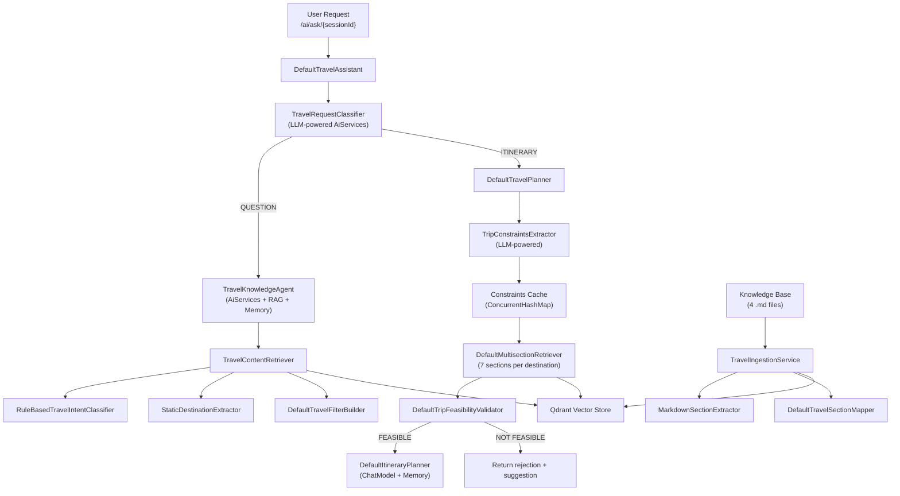

# 🧳 Travel AI Assistant — Complete Project Analysis

## Architecture Overview

---

## Current Tech Stack

| Component | Technology |
|---|---|
| Framework | Spring Boot 4.1.0 |
| AI Framework | LangChain4j 1.15.1 |
| LLM | Groq (Llama 3.3 70B) via OpenAI-compatible API |
| Embeddings | HuggingFace `all-MiniLM-L6-v2` |
| Vector Store | Qdrant (Cloud, TLS) |
| Document Parsing | Apache Tika + Custom Markdown Parser |
| Language | Java 25 |
| Build | Maven |

---

## What You've Already Built ✅

### 1. Smart Request Routing
- **LLM-powered classifier** ([TravelRequestClassifier](file:///c:/Users/Nisarg/OneDrive/Desktop/java/Langchain4j/Projects/Travel%20Assistant/src/main/java/com/n23/foa/travelassistant/classifiers/TravelRequestClassifier.java#8-43)) using `@SystemMessage` — distinguishes QUESTION vs ITINERARY requests
- Two-path architecture: Knowledge agent for questions, Planner pipeline for itineraries

### 2. Advanced RAG Pipeline
- **Ingestion**: Custom [MarkdownSectionExtractor](file:///c:/Users/Nisarg/OneDrive/Desktop/java/Langchain4j/Projects/Travel%20Assistant/src/main/java/com/n23/foa/travelassistant/ingestion/MarkdownSectionExtractor.java#9-47) → [DefaultTravelSectionMapper](file:///c:/Users/Nisarg/OneDrive/Desktop/java/Langchain4j/Projects/Travel%20Assistant/src/main/java/com/n23/foa/travelassistant/ingestion/DefaultTravelSectionMapper.java#9-25) → Qdrant
- **Metadata-enriched segments**: Each chunk tagged with `destination` + [section](file:///c:/Users/Nisarg/OneDrive/Desktop/java/Langchain4j/Projects/Travel%20Assistant/src/main/java/com/n23/foa/travelassistant/retriever/meltisection_retriever/imple/DefaultMultisectionRetriever.java#21-148) metadata
- **Multi-section retrieval**: [DefaultMultisectionRetriever](file:///c:/Users/Nisarg/OneDrive/Desktop/java/Langchain4j/Projects/Travel%20Assistant/src/main/java/com/n23/foa/travelassistant/retriever/meltisection_retriever/imple/DefaultMultisectionRetriever.java#21-148) pulls from 7 knowledge sections (Attractions, Accommodation, Food, Transport, Planning Metadata, Budget, Tips)
- **Intent-aware filtering**: [RuleBasedTravelIntentClassifier](file:///c:/Users/Nisarg/OneDrive/Desktop/java/Langchain4j/Projects/Travel%20Assistant/src/main/java/com/n23/foa/travelassistant/retriever/RuleBasedTravelIntentClassifier.java#7-61) → [DefaultTravelFilterBuilder](file:///c:/Users/Nisarg/OneDrive/Desktop/java/Langchain4j/Projects/Travel%20Assistant/src/main/java/com/n23/foa/travelassistant/filters/DefaultTravelFilterBuilder.java#15-89) for precise metadata filtering
- **Custom content injector**: [TravelContentInjector](file:///c:/Users/Nisarg/OneDrive/Desktop/java/Langchain4j/Projects/Travel%20Assistant/src/main/java/com/n23/foa/travelassistant/retrievalAugmentor/TravelContentInjector.java#12-88) builds structured prompts with retrieved context

### 3. Conversational Memory
- [InMemoryChatMemoryStore](file:///c:/Users/Nisarg/OneDrive/Desktop/java/Langchain4j/Projects/Travel%20Assistant/src/main/java/com/n23/foa/travelassistant/memory/InMemoryChatMemoryStore.java#12-55) (ConcurrentHashMap-based) implementing [ChatMemoryStore](file:///c:/Users/Nisarg/OneDrive/Desktop/java/Langchain4j/Projects/Travel%20Assistant/src/main/java/com/n23/foa/travelassistant/memory/InMemoryChatMemoryStore.java#12-55)
- Session-based `MessageWindowChatMemory` with 20-message window
- [ChatMemoryProvider](file:///c:/Users/Nisarg/OneDrive/Desktop/java/Langchain4j/Projects/Travel%20Assistant/src/main/java/com/n23/foa/travelassistant/config/ChatMemoryProviderConfig.java#11-24) per-session via config
- **Constraints caching**: [DefaultTravelPlanner](file:///c:/Users/Nisarg/OneDrive/Desktop/java/Langchain4j/Projects/Travel%20Assistant/src/main/java/com/n23/foa/travelassistant/service/DefaultTravelPlanner.java#16-130) caches trip constraints per session, enabling follow-ups like "make it cheaper"

### 4. Multi-Step Planner Pipeline
- **LLM-based constraint extraction** ([TripConstraintsExtractor](file:///c:/Users/Nisarg/OneDrive/Desktop/java/Langchain4j/Projects/Travel%20Assistant/src/main/java/com/n23/foa/travelassistant/extractors/TripConstraintsExtractor.java#7-27)) — extracts destination, days, budget from natural language
- **Constraint merging** — handles partial follow-ups (e.g., "change to 3 days") by merging with cached constraints
- **Feasibility validation** — [TripFeasibilityExpert](file:///c:/Users/Nisarg/OneDrive/Desktop/java/Langchain4j/Projects/Travel%20Assistant/src/main/java/com/n23/foa/travelassistant/agents/TripFeasibilityExpert.java#5-11) validates budget viability with RAG context
- **Itinerary generation** — structured prompt with budget rules, retrieved knowledge, and history

### 5. Knowledge Base
- 4 Indian destinations: Goa, Jaipur, Kerala, Manali
- Structured markdown format with consistent sections

---

## Feature Suggestions 🚀

### 🔴 High Impact (Core Functionality)

| # | Feature | Description | Complexity |
|---|---|---|---|
| 1 | **Structured JSON Response** | Return itinerary as structured JSON (with `@V` extraction or JSON mode) instead of raw text — makes frontend rendering easy | Medium |
| 2 | **Multi-Destination Trip Planning** | Support itineraries spanning multiple cities (e.g., "Goa + Hampi in 7 days") with inter-city travel logic | High |
| 3 | **Traveler Preference Profiles** | Add `travelStyle` (backpacker/luxury/family), `interests` (adventure/culture/nature), `dietary` preferences to [TripConstraints](file:///c:/Users/Nisarg/OneDrive/Desktop/java/Langchain4j/Projects/Travel%20Assistant/src/main/java/com/n23/foa/travelassistant/dto/TripConstraints.java#3-9) | Medium |
| 4 | **Streaming Response (SSE)** | Use `Flux<String>` / Server-Sent Events for real-time itinerary streaming instead of waiting for full response | Medium |
| 5 | **Dynamic Destination Discovery** | Replace [StaticDestinationExtractor](file:///c:/Users/Nisarg/OneDrive/Desktop/java/Langchain4j/Projects/Travel%20Assistant/src/main/java/com/n23/foa/travelassistant/retriever/StaticDestinationExtractor.java#10-44) with LLM-based extraction — supports any destination, not just hardcoded 10 | Low |

### 🟡 Medium Impact (Intelligence & Quality)

| # | Feature | Description | Complexity |
|---|---|---|---|
| 6 | **Seasonal Awareness** | Factor in `travelMonth` — suggest best activities for the season, warn about monsoons/extreme weather | Medium |
| 7 | **Itinerary Comparison** | Generate 2-3 plan variants (budget/comfort/premium) and let user pick | Medium |
| 8 | **Re-ranking / Cross-Encoder** | Add a cross-encoder re-ranker after initial retrieval to improve RAG precision | Medium |
| 9 | **Hybrid Search** | Combine semantic search + keyword search (BM25) in Qdrant for better retrieval | Medium |
| 10 | **Guardrails & Input Validation** | Add input sanitization, prompt injection protection, and topic guardrails (reject non-travel queries) | Low |

### 🟢 Enhancement Features

| # | Feature | Description | Complexity |
|---|---|---|---|
| 11 | **PDF/Image Export** | Generate downloadable PDF itinerary with maps and formatting | High |
| 12 | **Knowledge Base Auto-Expansion** | Web scraping / API-based ingestion to auto-populate new destinations | High |
| 13 | **User Feedback Loop** | Let users rate itineraries, store feedback to improve future plans (RLHF-lite) | Medium |
| 14 | **Caching Layer** | Cache LLM responses for identical/similar queries using Redis or embedding-based similarity | Medium |
| 15 | **Observability & Tracing** | Add LangChain4j `ChatModelListener`, log token usage, latency, and retrieval scores | Low |
| 16 | **Unit & Integration Tests** | Add tests for classifier, extractor, retriever, and planner pipeline | Medium |
| 17 | **Frontend UI** | Build a React/Next.js chat UI with session management, markdown rendering, and streaming | High |
| 18 | **API Authentication** | Add Spring Security with JWT for multi-user session management | Medium |

### 🔧 Code Quality Improvements

| # | Improvement | Details |
|---|---|---|
| A | Remove `System.out.println` debug logging | Replace with SLF4J (`@Slf4j` via Lombok) |
| B | Remove commented-out code | [DefaultItineraryPlanner](file:///c:/Users/Nisarg/OneDrive/Desktop/java/Langchain4j/Projects/Travel%20Assistant/src/main/java/com/n23/foa/travelassistant/service/DefaultItineraryPlanner.java#19-161) has ~180 lines of dead code (lines 162-342) |
| C | Collection name hardcoded | [EmbeddingConfig](file:///c:/Users/Nisarg/OneDrive/Desktop/java/Langchain4j/Projects/Travel%20Assistant/src/main/java/com/n23/foa/travelassistant/config/EmbeddingConfig.java#15-59) has `"travel-docs-ingestor"` hardcoded instead of using `${qdrant.collection-name}` |
| D | [Test.java](file:///c:/Users/Nisarg/OneDrive/Desktop/java/Langchain4j/Projects/Travel%20Assistant/src/main/java/com/n23/foa/travelassistant/ingestion/Test.java) in production code | `ingestion/Test.java` and controller dependency on `Test` should be cleaned up |
| E | Rename typo | `meltisection_retriever` → `multisection_retriever` (package name typo) |
| F | Hardcoded file path in ingestion | `TravelIngestionService.uploadFile()` has hardcoded absolute path |

---

> Ye mera complete analysis hai. Ab tum batao ki tumhara kya plan hai — konse features add karna chahte ho? Mai us hisaab se implementation plan banata hu. 🎯
