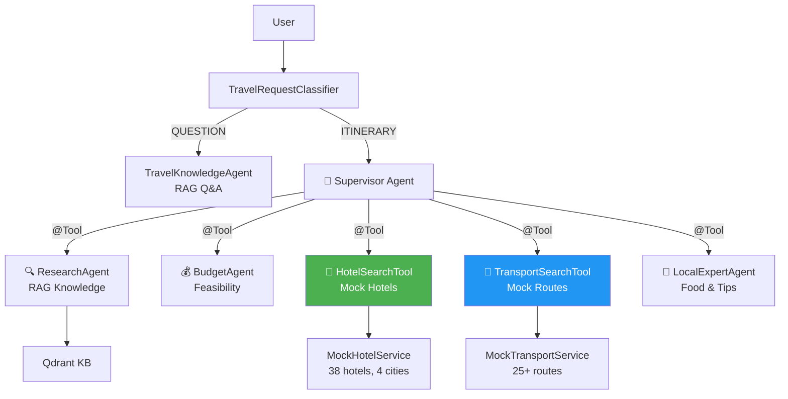

# 🤖 Travel AI Assistant — Multi-Agent System Walkthrough

## What We Built

Transformed a single-pipeline RAG travel assistant into an **industry-grade multi-agent system** with hotel and transport booking capabilities.

---

## Architecture



---

## Phase 1 Changes (Completed)

| File | Change |
|---|---|
| [ResearchAgentTool.java](file:///c:/Users/Nisarg/OneDrive/Desktop/java/Langchain4j/Projects/Travel%20Assistant/src/main/java/com/n23/foa/travelassistant/agents/tools/ResearchAgentTool.java) | RAG-powered destination research (Java-only, 0 LLM calls) |
| [BudgetAgentTool.java](file:///c:/Users/Nisarg/OneDrive/Desktop/java/Langchain4j/Projects/Travel%20Assistant/src/main/java/com/n23/foa/travelassistant/agents/tools/BudgetAgentTool.java) | Budget feasibility + cost breakdown (Java-only) |
| [LocalExpertAgentTool.java](file:///c:/Users/Nisarg/OneDrive/Desktop/java/Langchain4j/Projects/Travel%20Assistant/src/main/java/com/n23/foa/travelassistant/agents/tools/LocalExpertAgentTool.java) | Food, culture, tips (Java-only) |
| [TravelSupervisorAgent.java](file:///c:/Users/Nisarg/OneDrive/Desktop/java/Langchain4j/Projects/Travel%20Assistant/src/main/java/com/n23/foa/travelassistant/agents/TravelSupervisorAgent.java) | Orchestrator interface |
| [DefaultTravelAssistant.java](file:///c:/Users/Nisarg/OneDrive/Desktop/java/Langchain4j/Projects/Travel%20Assistant/src/main/java/com/n23/foa/travelassistant/service/DefaultTravelAssistant.java) | Routes ITINERARY → Supervisor |
| 6 files cleaned | Dead code removed, `System.out.println` → `@Slf4j` |

## Phase 2 Changes (Completed)

| File | Change |
|---|---|
| [MockHotelService.java](file:///c:/Users/Nisarg/OneDrive/Desktop/java/Langchain4j/Projects/Travel%20Assistant/src/main/java/com/n23/foa/travelassistant/service/mock/MockHotelService.java) | 38 hotels across Goa/Jaipur/Kerala/Manali |
| [MockTransportService.java](file:///c:/Users/Nisarg/OneDrive/Desktop/java/Langchain4j/Projects/Travel%20Assistant/src/main/java/com/n23/foa/travelassistant/service/mock/MockTransportService.java) | 25+ routes with flights/trains/buses |
| [HotelSearchTool.java](file:///c:/Users/Nisarg/OneDrive/Desktop/java/Langchain4j/Projects/Travel%20Assistant/src/main/java/com/n23/foa/travelassistant/agents/tools/HotelSearchTool.java) | @Tool for hotel search with markdown table |
| [TransportSearchTool.java](file:///c:/Users/Nisarg/OneDrive/Desktop/java/Langchain4j/Projects/Travel%20Assistant/src/main/java/com/n23/foa/travelassistant/agents/tools/TransportSearchTool.java) | @Tool for transport search with route suggestions |
| [TravelSupervisorConfig.java](file:///c:/Users/Nisarg/OneDrive/Desktop/java/Langchain4j/Projects/Travel%20Assistant/src/main/java/com/n23/foa/travelassistant/config/TravelSupervisorConfig.java) | 5 tools wired, updated orchestration workflow |
| User-created DTOs/Enums | [HotelOption](file:///c:/Users/Nisarg/OneDrive/Desktop/java/Langchain4j/Projects/Travel%20Assistant/src/main/java/com/n23/foa/travelassistant/dto/HotelOption.java#5-15), [TransportOption](file:///c:/Users/Nisarg/OneDrive/Desktop/java/Langchain4j/Projects/Travel%20Assistant/src/main/java/com/n23/foa/travelassistant/dto/TransportOption.java#5-15), `HotelType`, `TravelMode`, `TravelStyle`, `Interests` |

---

## Testing

```bash
# Start the application
.\mvnw spring-boot:run

# Test full multi-agent planning with hotels + transport
curl -X POST http://localhost:8080/ai/ask/test-1 ^
  -H "Content-Type: application/json" ^
  -d "\"Plan a 4-day Goa trip from Mumbai for 2 people, budget 30k, we love beaches and seafood\""

# Test with train preference
curl -X POST http://localhost:8080/ai/ask/test-2 ^
  -H "Content-Type: application/json" ^
  -d "\"Plan a 3-day Jaipur trip from Delhi for 4 people, budget 40k, prefer train, interested in culture\""
```

**Expected:** Response includes hotel recommendations with names/prices, transport options table, day-wise itinerary, budget breakdown, and local tips.
